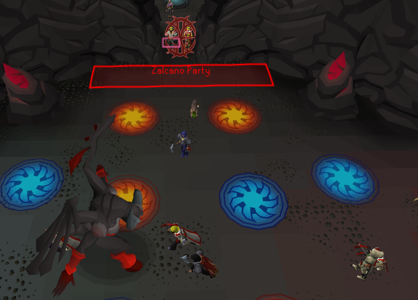
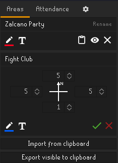
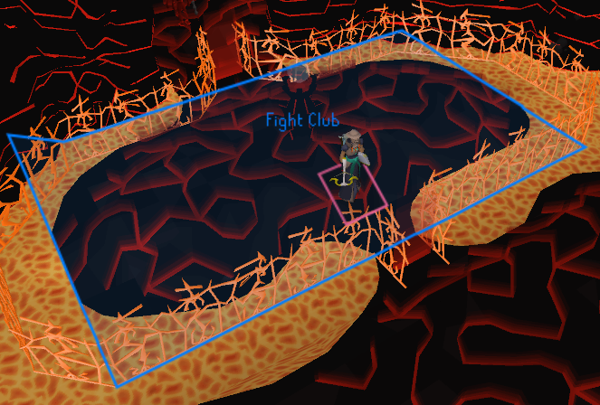
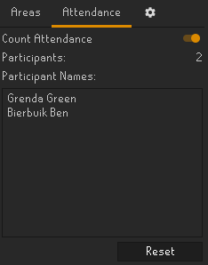

# Event Tools - Attendance Counting
An area based attendance counter for community events.

## Features
  - Automated participant counting for community hosted events.

## Setting up the tracker
### Creating capture areas
To track whoever is participating in your event you'll have to create a 'Capture Area'.
Any new player who steps into this area will be counted.
These areas can be created from the 'Area' tab in the side panel.
You can create however many you like to mark off specific areas or to cover oddly shaped areas.

You can disable a capture area and hide it from view using the 'Eye' icon.

Make sure the entire capture area is within your render distance so everyone gets tracked.
Parts of the area outside of render distance are shown in a different color.

We recommend setting up the capture area in a lobby area or similar area the participants in your event will walk through.

### Starting the tracker
Once you're happy with your capture areas and are ready to start the event.
All you have to do is switch over to the 'Attendance' panel and flick the 'Count Attendance' toggle.
Anyone entering the capture area will automatically be counted as a participant.

## Other settings
### Hide Overlay
The 'Hide Overlay' option disables the in game capture area overlay without disabling the tracking on any capture areas that have been set to 'Visible'.
This could be useful for capturing clean footage for your events cool highlight reel.

### Show Render Distance
The 'Show Render Distance' option shows you a blue outline of the 31x31 render distance area in which players and npc's are rendered.
